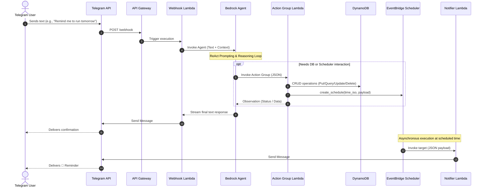

# ⏱️ LifeLogger AI
**Your personal, cloud-native routine and reminder assistant.** A fully serverless Telegram bot that tracks daily habits, kids' routines, maintenance tasks, and sets intelligent timezone-aware reminders using state-of-the-art LLMs via Amazon Bedrock.

---

## 🚀 Key Features
* **Conversational Logging:** Just text the bot (e.g., "I took my vitamins" or "Changed the bike sealant"), and it automatically infers the category and logs it to DynamoDB.
* **Timezone-Aware Reminders:** Seamlessly schedules future alerts (e.g., "remind me tomorrow at 8 AM") by calculating local time and converting it to UTC for **Amazon EventBridge Scheduler**.
* **Agentic CRUD Operations:** The LLM manages its own database records. You can ask it to "fix the typo in the last entry" or "delete yesterday's pill record," and it will fetch the exact timestamp to perform the update/delete.
* **Multi-User & Shared Context:** Securely handles personal logs based on Telegram IDs while allowing shared access to kids' routines.
* **Advanced Alias Resolution:** Translates casual names (e.g., "kiddo", "princess") into strict database entities automatically via Lambda environment variables.

---

## 🛠 Tech Stack
* **LLM:** OpenAI gpt-oss-120b for reasoning and natural language processing (via Amazon Bedrock).
* **Backend:** AWS Lambda (Python 3.12).
* **Task Scheduling:** Amazon EventBridge Scheduler (One-off schedules with auto-cleanup).
* **API:** Amazon API Gateway (HTTP API).
* **Database:** Amazon DynamoDB.
* **IaC:** AWS CloudFormation.

## 🏗 Architecture Overview
This project implements an event-driven, serverless architecture to ensure zero idle costs and high scalability. The core reasoning loop is delegated to Amazon Bedrock Agents. Reminders are handled asynchronously via EventBridge, bypassing the LLM for immediate, cost-free delivery.



## 🧠 Bedrock Agent System Instructions
*Note: In the provided CloudFormation template, this is automatically injected into the Agent via the `AutoPrepare` flag using the Draft/TSTALIASID pattern for instant updates.*

### Critical Rules
1. NEVER end your responses with a question.
2. NEVER ask the user to clarify missing parameters. Infer them from the context.
3. If a user inputs a statement like "I drank vitamins", log it immediately. 

### Timezone & Reminders
The user is located in the timezone: `{UserTimeZone}`.
When the user asks to schedule a reminder for a relative time, calculate the target date and time in the user's LOCAL timezone first, then convert it strictly into UTC format "YYYY-MM-DDThh:mm:ss" before calling `schedule_reminder`.

### Update and Delete Protocol
If the user asks to modify or delete a previously saved event:
1. If you don't have the exact timestamp in your immediate history, YOU MUST call `get_events_history` FIRST to find the EXACT `original_utc_key` of the target event.
2. Once you have the exact `original_utc_key` string, call `delete_event` or `update_event` and pass it as the 'timestamp' parameter.
NEVER guess the timestamp.

### Categorization Protocol
Assign a category automatically:
- `health`: physiology, nutrition, stool, pills, sleep, pain.
- `bike`: bicycles, tires, sealant, gear.
- `maintenance`: Tech, house repairs, car.
- `routine`: General daily tasks.

---

## 🛠 Action Group Details
*Configured in the Bedrock Action Group to act as the LLM's hands.*

| Function | Description | Key Parameters |
| :--- | :--- | :--- |
| `log_event` | Saves an event to the database. | `target_id`, `category`, `description` |
| `delete_event` | Deletes an event from the database. | `target_id`, `timestamp` (exact UTC key required) |
| `update_event` | Updates an existing event. | `target_id`, `timestamp`, `new_description`, `new_category` |
| `schedule_reminder`| Sets a scheduled EventBridge reminder. | `target_id`, `time_iso` (UTC), `description` |
| `get_events_history`| Retrieves event history with local time conversions. | `target_id`, `days` |

---

## 📦 Deployment Instructions

1. **Create a Telegram Bot:** Go to [@BotFather](https://t.me/botfather), create a new bot, and save the HTTP API Token.
2. **Get User IDs:** Message [@userinfobot](https://t.me/userinfobot) to get your personal Telegram Chat ID (and your partner's ID if needed).
3. **Deploy via CloudFormation:** Deploy the `lifelogger-auto.yaml` stack in your AWS Console. You will need to provide:
   * `TelegramBotToken`: Your BotFather token.
   * `UserMappingJson`: e.g., `{"123456789": "Admin", "987654321": "Partner"}`
   * `KidsMappingJson`: Define primary names and their aliases.
   * `UserTimeZone`: e.g., `Australia/Melbourne` or `Europe/London`.
4. **Set the Webhook:** Once the CloudFormation stack is `CREATE_COMPLETE`, go to the Outputs tab, copy the `WebhookUrl`, and run the following command in your terminal:
   ```bash
   curl -X POST "[https://api.telegram.org/bot](https://api.telegram.org/bot)<YOUR_BOT_TOKEN>/setWebhook?url=<YOUR_WEBHOOK_URL>"